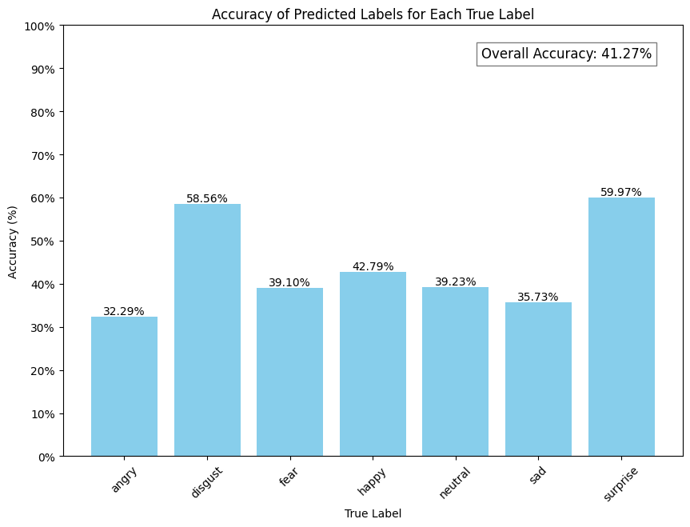
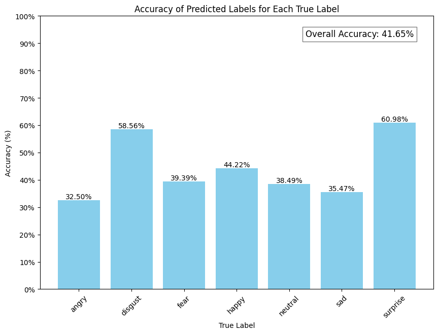

Standart Scaler & n_components=0.95 PCA results

Standart Scaler & best_eigenvectors = 150

Manuel PCA variance_threshold-accuracies

[{0.23874893857911123, 0.6},
 {0.32790829323521087, 0.7},
 {0.37333710727427116, 0.75},
 {0.41395414661760543, 0.8},
 {0.43320124540050947, 0.85},
 {0.44523068213982453, 0.9},
 {0.4524483441834135, 0.95}]